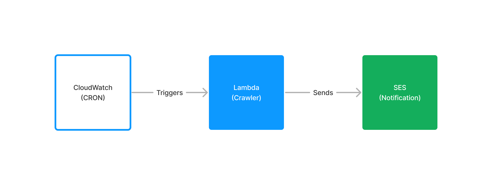

# Smiles BOT

## What it does?

It checks the active promotions page to see if any of the promotions meet some (regex) criteria. If so, it notifies the user via email.

## Architecture

<!-- image from docs/architecture.pgn -->

